# ByteShelf

ByteShelf is a modern cloud storage dashboard built with **Next.js (App Router)** and **Appwrite**. It enables users to securely upload, organize, share, and manage files through a clean and responsive web interface.

---

## 🚀 Key Features

- ✅ Passwordless email login via **OTP**
- ✅ Upload files with drag & drop support
- ✅ Share files with other users by email
- ✅ Rename / delete / download files
- ✅ Live storage usage dashboard (per-user quota)
- ✅ Admin analytics: user growth, file type breakdown, storage stats
- ✅ Mobile-friendly UI with responsive navigation

---

## 🗂️ Tech Stack

- **Next.js 15** (App Router)
- **React 19**
- **TypeScript**
- **Tailwind CSS**
- **Shadcn UI**
- **Appwrite** (Authentication, Database, Storage)
- **Syncfusion Charts**

---

## 🧩 Project Structure (Highlights)

- `app/` – app routes
  - `(auth)` – sign-in / sign-up
  - `(root)` – file browsing, dashboard
  - `(admin)` – admin dashboard + user management
- `components/` – UI components (upload, cards, modals, charts, etc.)
- `lib/` – Appwrite clients + action handlers + utilities
- `constants/` – navigation, dropdown actions, limits

---

## 🛠️ Setup

### 1. Install dependencies

```bash
npm install
```

### 2. Configure environment variables

Copy `.env.example` to `.env.local` and fill in your Appwrite values:

```env
NEXT_PUBLIC_APPWRITE_ENDPOINT=
NEXT_PUBLIC_APPWRITE_PROJECT=
NEXT_PUBLIC_APPWRITE_DATABASE=
NEXT_PUBLIC_APPWRITE_USERS_COLLECTION=
NEXT_PUBLIC_APPWRITE_FILES_COLLECTION=
NEXT_PUBLIC_APPWRITE_BUCKET=
NEXT_APPWRITE_KEY=
NEXT_PUBLIC_SYNCFUSION_LICENSE_KEY=
```

### 3. Run the development server

```bash
npm run dev
```

Open: http://localhost:3000

---

## 📸 Screenshots

### Admin Dashboard

.png)
.png)

### Admin User Management

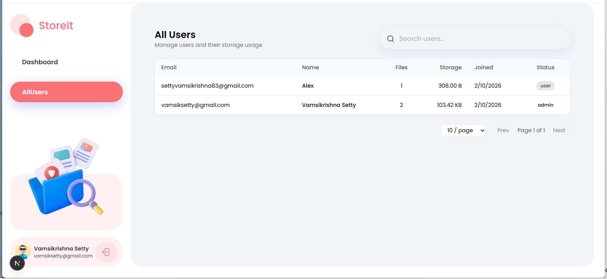

### File Browser

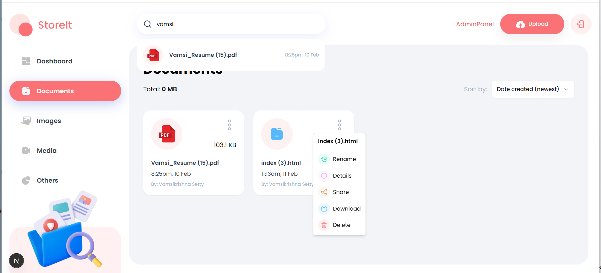
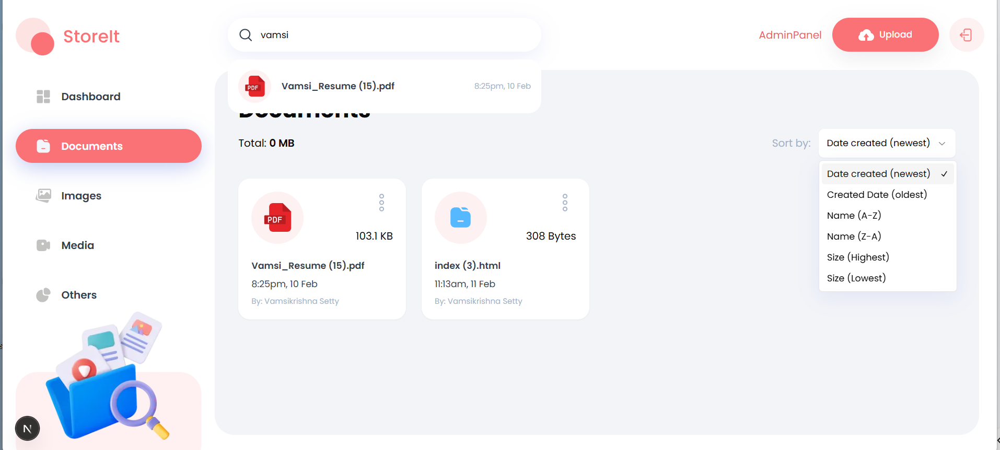

### File Actions

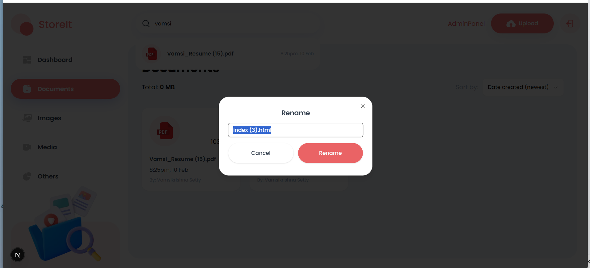
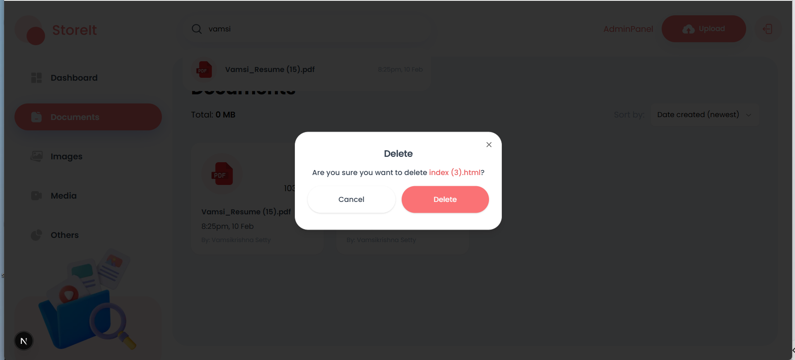
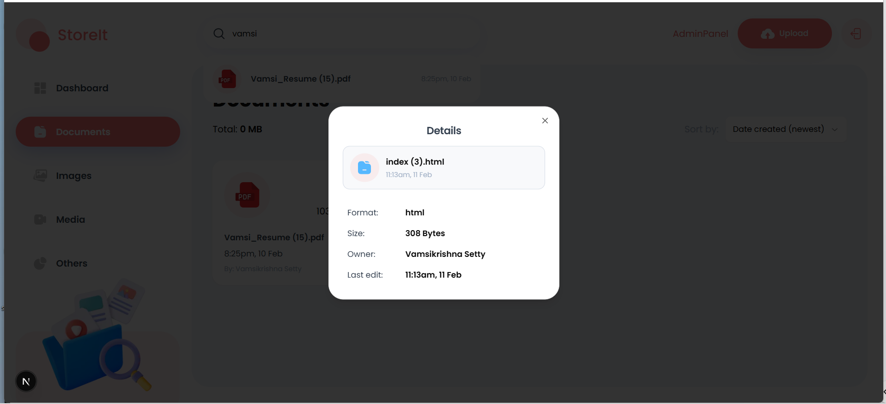
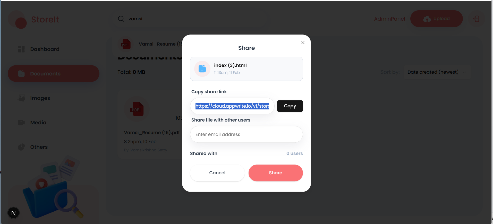

### Additional Screenshots

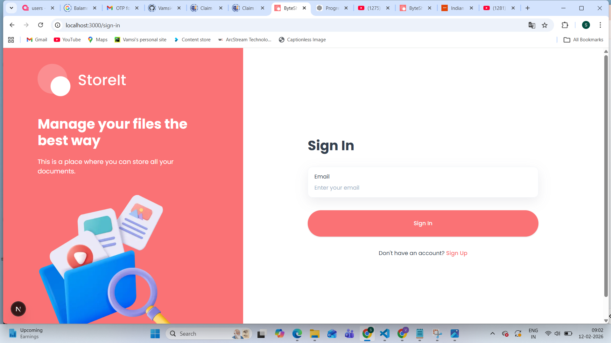
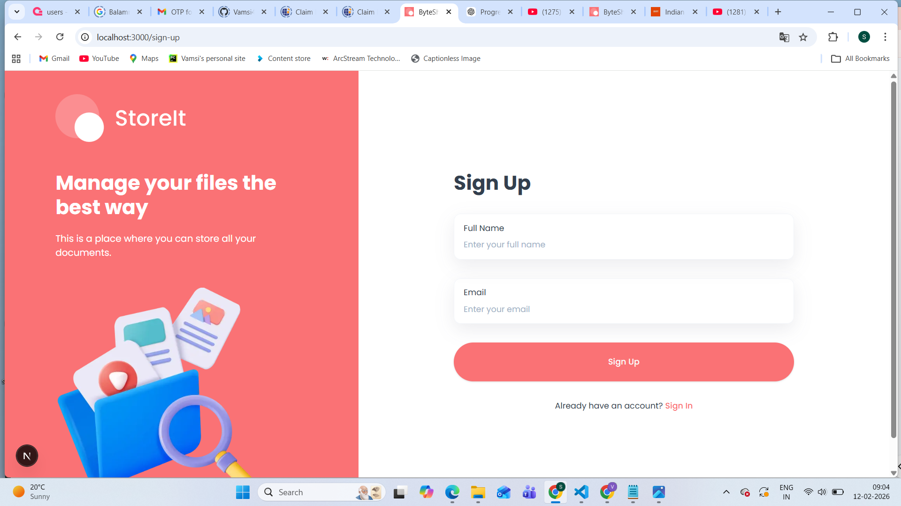
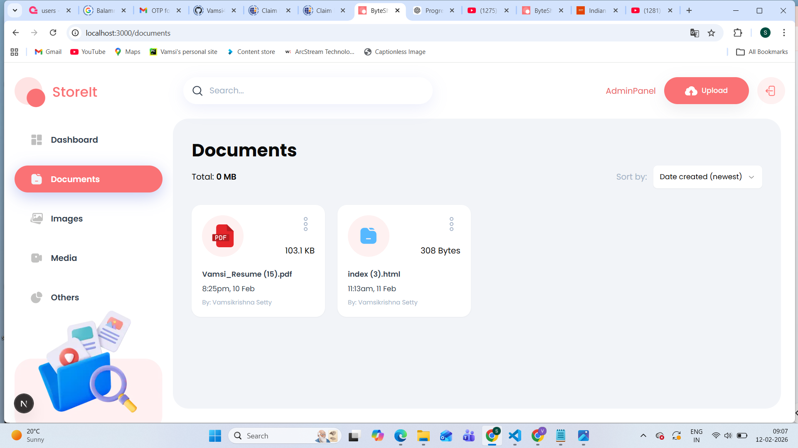
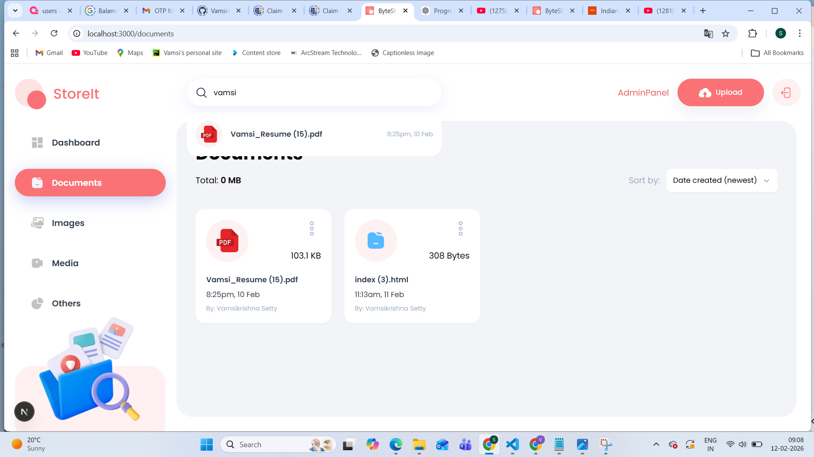

---

## 📝 Usage

1. Sign up / sign in with your email.
2. Upload files in the dashboard.
3. Browse files by category (Documents, Images, Media, Others).
4. Use the action menu on each file to rename, share, download, or delete.

---

## 🚀 Deployment

Build for production:

```bash
npm run build
npm run start
```

To deploy on Vercel:

1. Push to GitHub.
2. Import the repo in Vercel.
3. Set the required environment variables.
4. Deploy.
